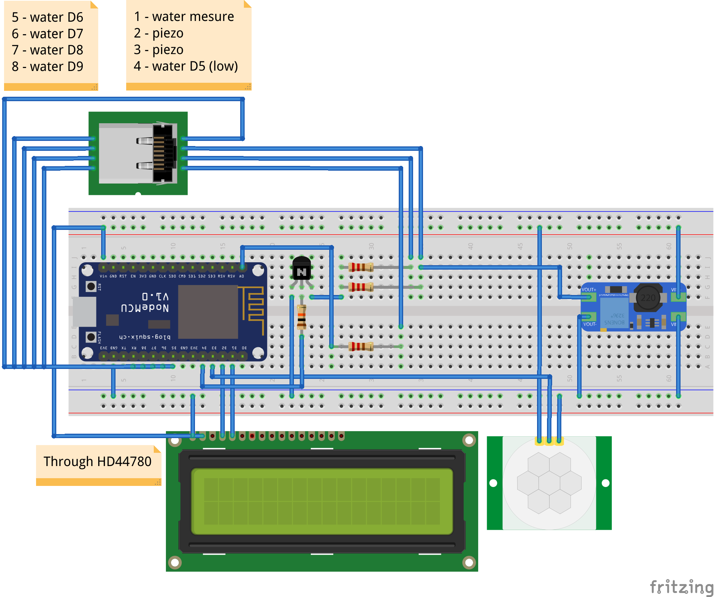

# Water Mole

Arduino project of piezoelectric mole repellent and waste water level monitor.

These are actually two separate projects fit into one package. First is a mole repellent that uses parallel array of passive piezoelectric buzzers. Every few minutes (or less) set of random tones is emitted. Buzzers are sealed and digged in the ground (actually in mole tunnels). This should work as most mole repellents work this way.

Second project is a waste water meter. A sewage tank will contain a set of wires at different fill levels e.g. at 5%, 25%, 50%, 80%, 90%, 95%. Information about which level is reached is displayed on LCD screed. Motion detector is used to set backlit and enable display.

Electronics are set in home and are connected with external wires by LAN cable. 

# Main components

* ESP8266 NodeMCU V2 - Arduino-compatible board.
* MT3608 DC-DC Converter - to power passive piezoelectric buzzers with 12V.
* 16x2 LCD with HD44780 controller - to display water level.
* HC-SR501 PIR - motion detector to activate display when needed.
* 2N2222 - NPN transistor used as a switch to activate buzzers.

# I/O

* Powered with 5V wall USB charger.
* Analog input used for detecting water level.
* Digital output to trigger buzzers.
* Digital input to react on motion detector.
* Remaining digital outputs to test against set water levels.
* I2S for LCD display.
* Micro USB as power source.
* RJ45 keystone as output for buzzer, analog in and digital water level outputs.

# Operation logic

The non-trivial part of the project is water level detection. This is done by reading the ground voltage on analog in pin (A0) by providing TTL output (LOW) from several digital out pins (D5 to D9).

Other idea is to close the circut with a TTL HIGH state. This method turned out to be not reliable bacause of varying waste water conductivity.

Yet another option would be to create a capacitance water level meter. Expected capacity would be in mid pico to low nano farad range. This is difficult because of few reasons. We could measure time constraint but for 1pF we need 1G Ohm resitor to have time of 1ms. These types of resistors are not so common and measuring millisecond times in Arduino is not that simple (for me). There is a simple way for that (2-wires meter) but 2 analog inputs are needed. ESP8266 has only one. Besides I suppose that waste water would eventually clog the capacitator.

# Breadboard

# Mole circuit 

Piezo electric buzzer is denoted as 1M Ohm resistor. It is in series connection with 220 Ohm resistor in case buzzer gets shorted.

# Disclaimer

I just realized that this project is also a C++ learning playground for me. I am a Java developer and I havn't code C++ for last 13 years. Since then I am doing full time Java and some Javascript. The code is not perfect but I don't want to fallback to C as code written as classes is more natural for me.
